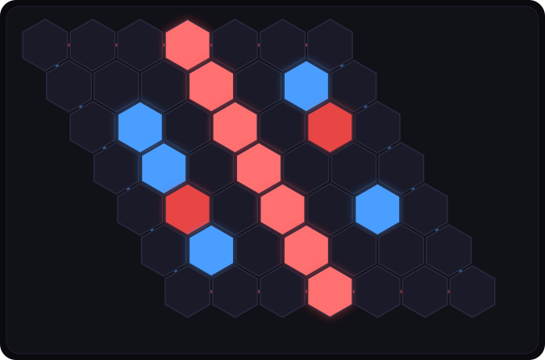

# HexArena


Hex de escritorio para Windows, empaquetado como un único `.exe` portable
(sin instalador). Contra la IA con niveles de dificultad, jugador vs jugador
local, y jugador vs jugador en red (LAN / IP directa).

<p align="center">
  
</p>

## Características

- **IA propia**: búsqueda MCTS con RAVE, sesgo por distancia (Dijkstra) y
  reconocimiento de puentes — no una biblioteca de terceros.
- **3 niveles de dificultad**: de "comete errores humanos" a "juega con todas
  las heurísticas activas", ajustando presupuesto de tiempo y agresividad de
  las heurísticas en un único motor parametrizado.
- **3 modos de juego**: contra la IA, jugador vs jugador local (hotseat), y
  jugador vs jugador en red (un jugador aloja, el otro se conecta por IP).
- **Un único `.exe` portable**: sin instalador, sin dependencias externas,
  corre desde cualquier carpeta o USB.
- **Motor de reglas centralizado**: una sola fuente de verdad para
  adyacencia/conexión/legalidad, compartida por la IA, el modo local y la red
  — nada de lógica duplicada que pueda desincronizarse.

## Origen

Nació de un proyecto de IA universitario (jugador de Hex vía MCTS) que solo
existía como una clase Python sin tablero ni interfaz. HexArena lo retoma
desde cero como aplicación completa: motor de reglas propio, IA fusionada y
mejorada, tres modos de juego, interfaz pulida y empaquetado real para
Windows.

## Ejecutar en desarrollo

```bash
py -m venv .venv
.venv\Scripts\pip install -r requirements.txt
.venv\Scripts\python main.py
```

## Generar el .exe portable

```bash
.venv\Scripts\pip install -r requirements.txt
.venv\Scripts\pyinstaller hex_app.spec
```

El resultado queda en `dist/HexArena.exe`: un único archivo, sin instalador,
que corre desde cualquier carpeta o USB. La primera vez que Windows lo
ejecute puede mostrar una advertencia de SmartScreen (el ejecutable no está
firmado); hay que elegir "Más información" → "Ejecutar de todas formas".

## Pruebas

```bash
.venv\Scripts\python tests\test_engine.py      # reglas + IA: legalidad, conexión, puentes
.venv\Scripts\python tests\test_network.py     # host/cliente por TCP en localhost
.venv\Scripts\python tests\test_difficulty.py  # Difícil debe ganarle a Fácil (lento, ~10s)
```

## Estructura

```
main.py             entry point: crea la ventana pywebview
engine/board.py      HexBoard: reglas, adyacencia, conexión, puentes
engine/ai.py         HexAI: MCTS + RAVE, sesgo Dijkstra, niveles de dificultad
engine/network.py    host/cliente TCP para el modo en red
engine/api.py        puente entre pywebview y la UI (window.pywebview.api.*)
ui/                  index.html + style.css + app.js
tests/                pruebas de reglas, IA y red
scripts/make_preview.py  genera docs/preview.svg (la imagen de arriba)
```

## Modo en red — alcance

Un jugador aloja la partida (queda escuchando en su red local) y comparte su
IP y puerto; el otro se conecta directamente. Es LAN / IP directa, sin
matchmaking ni NAT traversal — para jugar por internet el anfitrión tendría
que configurar port-forwarding en su router por su cuenta.

## Licencia

[MIT](LICENSE)
